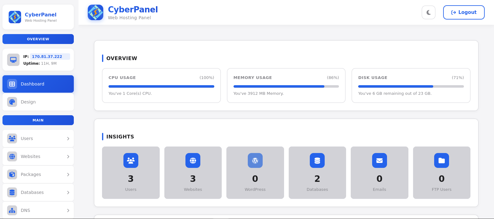
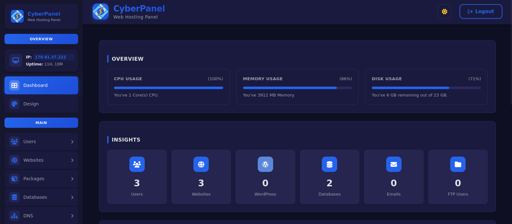

# HOSTSA THEME

##Copy this entire code into your CyberPanel -> Design Menu > Editor. After that, press "Save Changes" Button to apply it.

This is created by [Adriano Sena ](https://www.adrianosena.dev.br/)
**Kindly give the credit when you modify and apply**

Preview:

